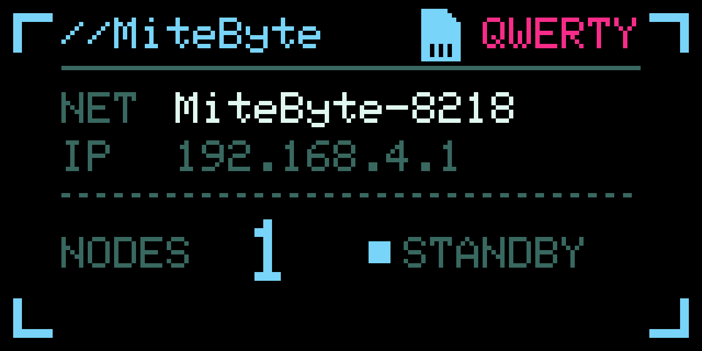
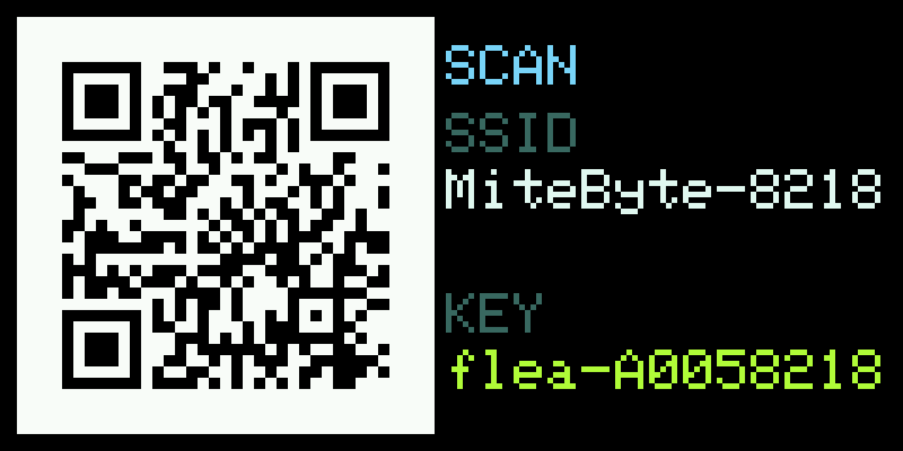
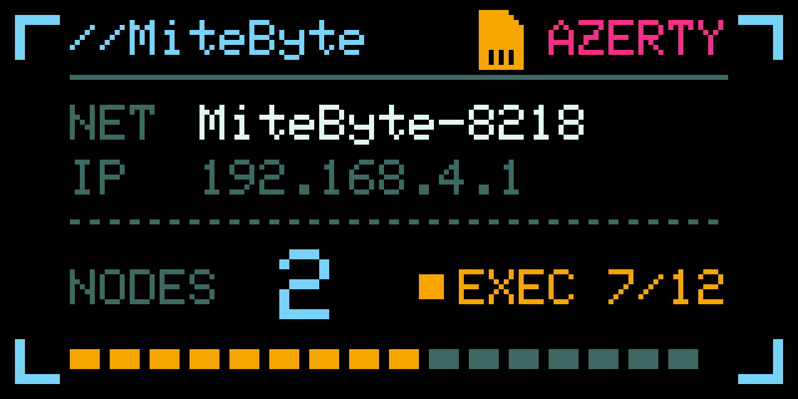

# MiteByte

**MiteByte is a fork of [FleaByte](https://github.com/b3rt1ng/FleaByte).** It is
firmware for the LilyGO T-Dongle S3: a programmable USB HID keyboard with a
self-hosted web UI for keyboard automation, built-in device tools, and USB mass
storage. Everything runs on the device — no cloud.

It adds, on top of upstream: a built-in device-tool framework, a USB-to-Wi-Fi
internet-sharing tool, an insertion lock with gesture unlock, LED/display
settings, and a per-tool source layout with consistent module naming.

> This fork was created to keep development moving without waiting on a pull
> request. If the upstream author is interested, I'm glad to merge it back into
> the original project.



## What it does

* Keyboard automation with a macro scripting language, edited in the browser
* Twelve keyboard layouts, switchable at runtime and mid-script
* A script library stored on the device, editable from the web UI
* Built-in device tools in the same library, with Start/Stop
* **Wi-Fi Hotspot:** share the host PC's internet with Wi-Fi devices over a
  private USB network interface (NAT + DNS forwarding)
* A Wi-Fi join code on the screen, so a phone connects without typing
* An insertion lock: the device stays dark and storage-only until unlocked with
  a button gesture
* microSD exposed to the host as a removable drive, with a web file browser
* Status screen and an LED that reports what the device is doing

| | |
|---|---|
|  |  |
| Scan to join, or read the credentials | Status while a script runs |

## Scope of use

Machines you own, or for which you hold authorisation. This is a USB HID
keyboard: it sends keystrokes to the machine it is connected to, so use it only
where you are permitted to.

## Hardware

A LilyGO T-Dongle S3. A microSD card is optional, used only by the USB drive
feature.

* [LilyGO store](https://lilygo.cc/products/t-dongle-s3)
* [Amazon](https://www.amazon.fr/dp/B0BK9162QY)

It has to be the **S3**: among the ESP32 variants LilyGO uses, only the S2, S3
and P4 have the USB-OTG controller this firmware needs.

## Installing

Build from source with PlatformIO:

```sh
pio run -e mitebyte -t upload
```

Or write a release image with esptool:

```sh
esptool --chip esp32s3 --port /dev/ttyACM0 write-flash 0x0 firmware.bin
```

The image stops before the filesystem partition, so an update keeps your saved
scripts and settings.

## Documentation

* [DOCS.md](DOCS.md) — building from source, the script commands, settings and
  the USB drive
* [DEVICE_TOOLS.md](DEVICE_TOOLS.md) — the compiled-in device-tool interface
* [NOTES.md](NOTES.md) — hardware quirks worth knowing before changing anything
* [Windows sharing setup](tools/windows/README.md) — the optional hotspot
  companion for Windows and the manual alternative

## Credits

Forked from [b3rt1ng/FleaByte](https://github.com/b3rt1ng/FleaByte) (MIT); the
original license and copyright are retained in [LICENSE](LICENSE).

Pin assignments and panel initialisation values come from
[LilyGO's T-Dongle S3 examples](https://github.com/Xinyuan-LilyGO/T-Dongle-S3)
(MIT). The display is driven through
[Adafruit GFX](https://github.com/adafruit/Adafruit-GFX-Library) and
[Adafruit ST7735](https://github.com/adafruit/Adafruit-ST7735-Library) (BSD).
Keyboard layout tables and the QR encoder ship with the
[ESP32 Arduino core](https://github.com/espressif/arduino-esp32).

## License

MIT, see [LICENSE](LICENSE).
